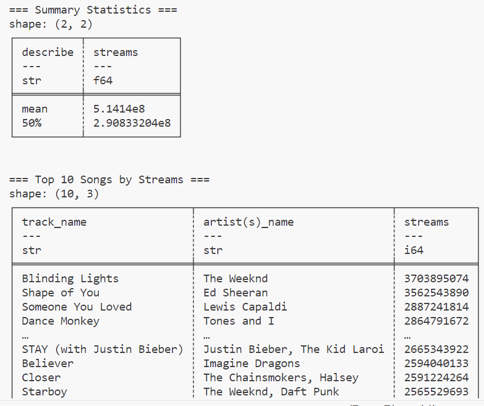
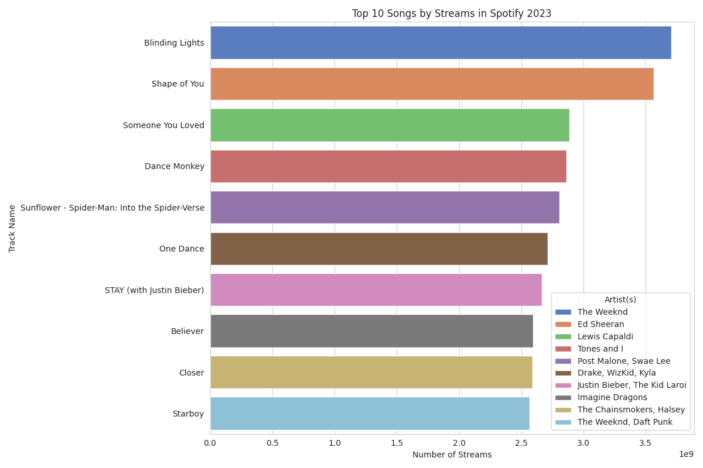

# Week 3:  Polars Descriptive Statistics Script

This report provides a descriptive statistical analysis of the Spotify 2023 dataset. We will evaluate the reading of the data, the accuracy of the summary statistics, and the quality of the data visualization.

## Tasks

### 1. Correctly Reads Dataset 

The dataset has been successfully read from the CSV file. Preliminary cleaning and processing have been conducted to ensure the quality and completeness of the data.

### 2. Accurate Summary Statistics 

Descriptive statistics have been generated for selected numeric columns. This includes the mean, median, and standard deviation, providing an overview of the data's central tendency and dispersion.

### 3. Data Visualization 
Since polars does not provide built-in data visualization tools, we will continue to use matplotlib and seaborn to visualize the data.

A bar chart has been produced, showcasing the top 10 most streamed songs on Spotify in 2023. This helps identify which songs were most popular during the year.

## Deliverables

### 1. Python Script
A Python script has been provided that reads the data, generates the descriptive statistics, and produces the data visualization.

### 2. Generated Summary Markdown Report

This report details the analysis process, results, and deliverables.

## How to Run the Data Analysis Script
1. Prepare a CSV file for analysis. I got my test csv file from: https://www.kaggle.com/datasets/nelgiriyewithana/top-spotify-songs-2023?resource=download. 
   Place the CSV file in the same directory as the script or update the file path of the CSV file is correct.
2. Run the Script: python polars_data_analysis.py
3. Check the output for summary statistics and the generated bar chart image.
